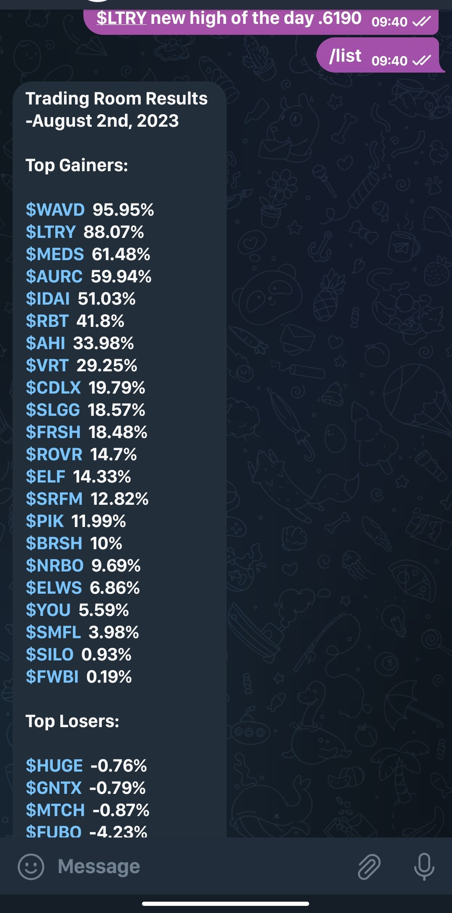

# SR List Bot

#### • This is a telegram bot based on NodeJS. It was a freelance project I developed for [Stock Region](https://www.stockregion.net/).

## Functionalities

- User can generate a list of daily gainer and loser stocks of U.S. Stock Market.

- The list contains the name of the tickers along with the percentage gain or lose in the regular market.

- Multiple user can use the bot at the same time.

## TechStack

- `NodeJS` for making the script and implementing business logic.

- `telegraf` to communicate with telegram API using NodeJS.

- `Dotenv` a NodeJs library for making environment variables and securely storing API key and telegram bot token.

- `Axios` for making http request.

- `Yahoo Finance API` for fetching real time U.S. Stock Market's precise data.

## Video Demo

Click on this thumbnail to watch the video.

## ScreenShot

 

